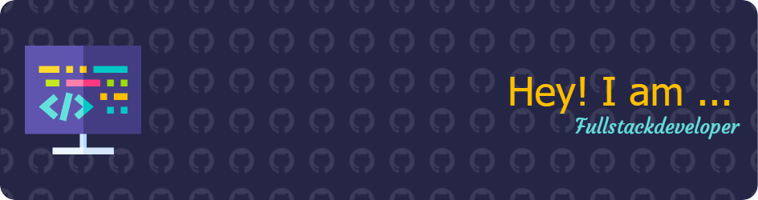

  

## 👩‍💻 About Me
- 🌱 Learning **MERN stack & Advanced JavaScript**
- 🔥 Passionate about **Python projects & building in public**
- 🚀 Goal: **Landing a Full Stack Developer job soon**

## ⚡ Tech Stack
**Frontend:** React, JavaScript, HTML, CSS  
**Backend:** Node.js, Express, Flask  
**Database:** MongoDB, SQLite  
**Others:** Git, Chrome Extensions, REST APIs

## 📈 GitHub Stats

## 🔗 Connect with Me

